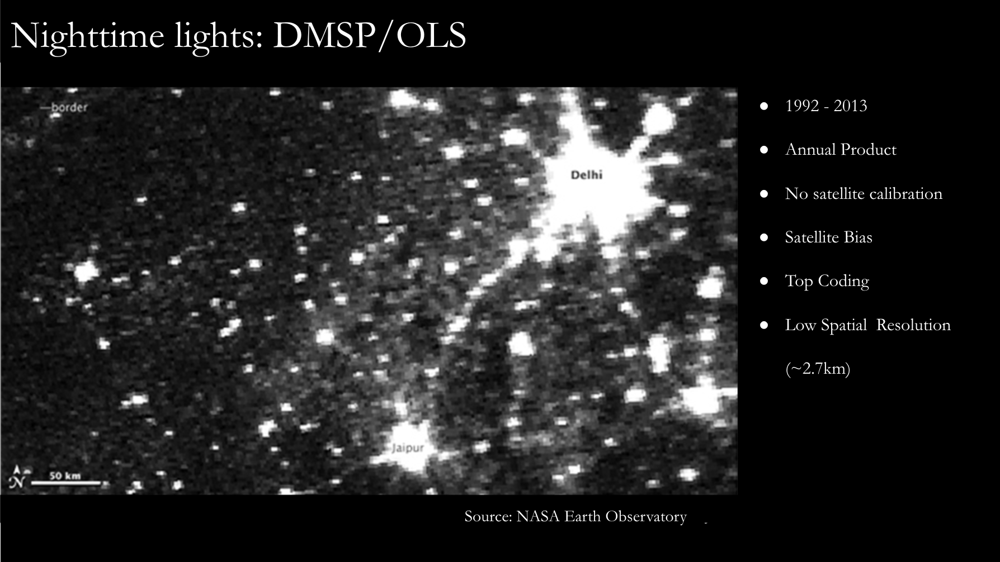
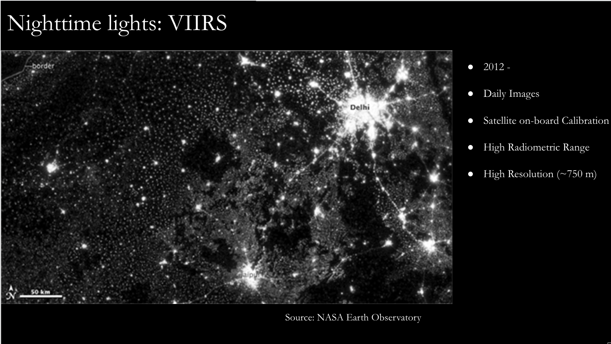
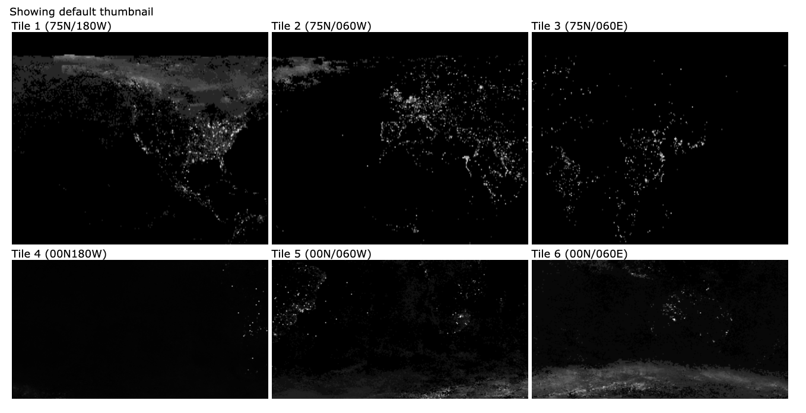

## **Nightlights for economic growth & development **
#### Everything you wanted to know but could not google

Nightlights is a measure of radiance, assessed over regions of earth surface, as seen from satellites. Over the years there have been multiple products released by NASA/NOAA/Colorado School of Mines. Namely,

1. DMSP (Annual: 1992-2012)

2. VIIRS (Monthly: 2012-onwards)

2. VIIRS (Annual: 2012-onwards)

DMSP or US Air Force Defense Meteorological Satellite Program was the earliest product aboard the  Operational Linescan System (OLS).

 
 

#### Nightlights: Beyond the Ctrl C + Ctrl V of the first paragraph in every Data section

Nightlights data has been used as a proxy for economic development since its public release by NASA/NOAA from 1992. However, the data has been compiled for long before that. The primary use of this data as the name 'US Air Force Defense Meteorological Satellite Program' suggests was considered to detect tanks and terrain army vehicles and is believed to have played a role in the operation Desert Fox (link).

 

#### Summary of empirical strategies

Nightlights has so far been used in economic literature under two broad heads, 

1. Macro: Assessing growth of countries with poor statistical capacity

2. Micro: Measuring 

 
 

#### Getting the data 

1. NASA/NOAA

2. Colorado School of Mines

3. Compiled repositories

 

### [Nightlights Data: EOD](https://eogdata.mines.edu/nighttime_light/)

